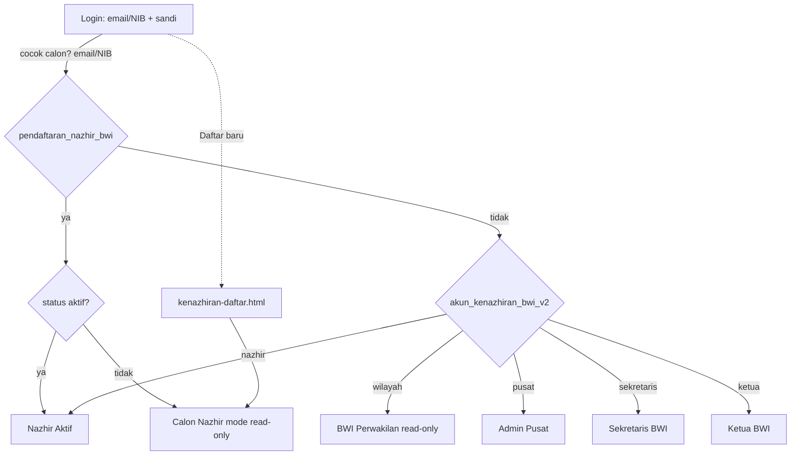
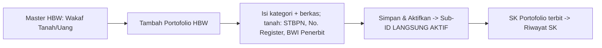
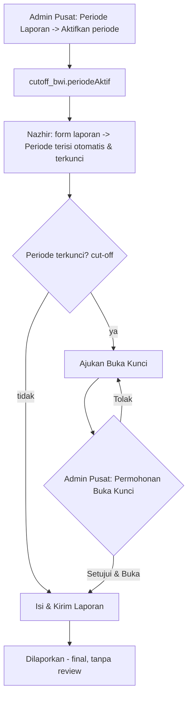
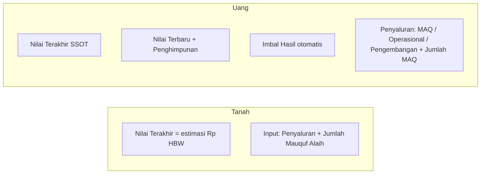

# PRD & Flow Design — Modul Kenazhiran (BWI SuperApps / Titik Terang OS)

> Dokumen ini merangkum **Product Requirement** dan **Flow Design** untuk seluruh menu pada prototipe **Modul Kenazhiran BWI**. Prototipe berupa **mockup HTML + Tailwind (vanilla JS + sebagian React via Babel)** dengan **localStorage** sebagai simulasi basis data (single-tenant, tanpa backend).

- **Produk:** Modul Kenazhiran — pengelolaan Nazhir, Harta Benda Wakaf (HBW), pelaporan, dan tata kelola nasional.
- **Identitas visual:** Deep Teal (`brand` 50→900), font Outfit, ikon inline SVG (tanpa emoji), shell TailAdmin (sidebar + topbar).
- **Bahasa UI:** Indonesia.
- **Konvensi tabel (global, semua role):** setiap tabel data memakai **pagination bernomor, default 5 baris/halaman** — footer "Menampilkan {from}–{to} dari {total}" di kiri; kontrol kanan = **Sebelumnya + tombol nomor halaman + Berikutnya** (nomor aktif disorot brand; ellipsis "…" bila > 7 halaman; Sebelumnya/Berikutnya disabled di ujung); halaman **reset ke 1** saat search/filter/tab berubah; nomor urut kontinu antar‑halaman. Helper `tombolNomor(total, perHal, current, fnGoto)` + `goto*(n)` per tabel.

---

## 1. Ringkasan Produk (Vision)

Menyediakan satu sistem terintegrasi bagi ekosistem perwakafan Indonesia yang menghubungkan **Nazhir**, **BWI Perwakilan**, dan **BWI Pusat** dalam satu identitas **NIB (Nomor Induk BWI) tunggal**. Sistem memfasilitasi:

1. **Pendaftaran & sertifikasi Nazhir** (progresif, berbasis kelengkapan berkas + presentasi).
2. **Pencatatan Harta Benda Wakaf (HBW)** — wakaf tanah & wakaf uang — sebagai Sub‑ID di bawah NIB.
3. **Pelaporan berkala** dengan konsep **SSOT (Single Source of Truth)** dan **cut‑off periode**.
4. **Tata kelola nasional** oleh BWI Pusat: verifikasi, penerbitan SK, periode laporan, penguncian, dan pembukaan akses.

---

## 2. Peran (Roles) & Akun Demo

| Peran | Deskripsi | Email | Sandi | Landing |
|---|---|---|---|---|
| **Nazhir Aktif** | Lembaga wakaf tersertifikasi (punya NIB). Akses penuh (CUD) atas HBW, program, & pelaporan. | `yayasannusantara@bwi.go.id` | `password` | `nazhir-dashboard.html` |
| **Calon Nazhir** | Lembaga dalam proses pendaftaran. Shell penuh tapi **read‑only** & data kosong sampai disetujui. | *daftar sendiri* | *dibuat sendiri* | `nazhir-dashboard.html` (mode calon) |
| **BWI Perwakilan** (Verifikator Wilayah) | Pemegang akun perwakilan. Memantau data kenazhiran daerah — **read‑only**. | `perwakilan@bwi.go.id` | `password` | `wilayah-dashboard.html` |
| **Administrator Pusat** | Admin BWI Kenazhiran Pusat. Tata kelola nasional penuh. | `adminpusat@bwi.go.id` | `password` | `pusat-dashboard.html` |
| **Sekretaris BWI** | Meninjau **setiap** pendaftaran nazhir; **meneruskan** yang telah disetujui Pusat ke Ketua untuk ditandatangani. | `sekretaris@bwi.go.id` | `password` | `sekretaris-pendaftaran.html` |
| **Ketua BWI** | **Menandatangani** (TTD digital + passphrase) pendaftaran yang telah diteruskan Sekretaris → menerbitkan NIB & SK. | `ketua@bwi.go.id` | `password` | `ketua-pendaftaran.html` |

- Autentikasi berbasis **email/NIB + sandi** yang tersimpan di `localStorage` (`akun_kenazhiran_bwi_v2`). Calon Nazhir tersimpan di `pendaftaran_nazhir_bwi`. Login memakai **satu kolom identitas** (bukan pemilih peran) — peran dikenali otomatis dari akun yang cocok. **Nazhir aktif** boleh masuk memakai **email atau NIB** (akun demo nazhir: NIB `NZHR-BDG-170`). Calon Nazhir yang mendaftar langsung dapat login dengan email + sandi‑nya.
- Sesi aktif: `sesi_kenazhiran = { mode, peran, nama }`.

---

## 3. Arsitektur Informasi (Peta Menu)

### 3.1 Auth
- **Login** (`kenazhiran-login.html`) — email/sandi + panel akun demo.
- **Pendaftaran Calon Nazhir** (`kenazhiran-daftar.html`) — form registrasi 2 fase.

### 3.2 Role: Nazhir (Aktif & Calon)
| Menu | Sub‑menu | Halaman |
|---|---|---|
| **Dashboard NIB** | — | `nazhir-dashboard.html` |
| **Master HBW** | Wakaf Tanah | `nazhir-aset.html?jenis=tanah` |
| | Wakaf Uang | `nazhir-aset.html?jenis=uang` |
| **Laporan HBW** | Pelaporan Wakaf Tanah | `nazhir-laporan-program.html?jenis=tanah` |
| | Pelaporan Wakaf Uang | `nazhir-laporan-program.html?jenis=uang` |
| | Pelaporan Mutasi Aset | `nazhir-laporan.html` |
| **Riwayat & Dokumen** | — | `nazhir-dokumen.html` |
| **Permohonan Buka Kunci** | — | `nazhir-buka-kunci.html` |

Halaman pendukung (tanpa menu langsung): `nazhir-aset-tambah.html` (tambah HBW), `nazhir-aset-detail.html`, `nazhir-aset-sk.html` (Riwayat SK Portofolio), `nazhir-sk.html` (SK Pendaftaran), `nazhir-pendaftaran.html` (checklist berkas calon), `nazhir-laporan-isi.html`, `nazhir-laporan-detail.html`, `nazhir-laporan-baru.html`.

> Catatan: menu **Master Program** disembunyikan (halaman `nazhir-program.html` masih ada namun tidak ditautkan).

### 3.3 Role: BWI Pusat (Administrator)
Urutan menu disusun mengikuti alur/tupoksi: monitor → siklus nazhir & akun → konfigurasi pelaporan → komunikasi.
| # | Menu | Halaman |
|---|---|---|
| 1 | **Dashboard** | `pusat-dashboard.html` |
| 2 | **Pendaftaran Nazhir** | `pusat-pendaftaran.html` → detail `pusat-pendaftaran-detail.html` |
| 3 | **NIB Nazhir** | `pusat-master.html` |
| 4 | **Laporan Nazhir** (tab Uang/Tanah) | `pusat-laporan.html` |
| 5 | **Master Pengguna** | `pusat-master-pengguna.html` |
| 6 | **Periode Laporan** | `pusat-periode.html` |
| 7 | **Permohonan Buka Periode** | `pusat-buka-periode.html` |
| 8 | **Kelola Broadcast** | `pusat-broadcast.html` |

Pendukung: `pusat-hierarki.html`. Halaman berikut **masih ada namun tidak lagi ditautkan** dari menu: `pusat-cutoff.html` (menu "Kelola Cut‑Off Periode" dihapus — beririsan dengan Periode Laporan) dan `pusat-portofolio.html`/`pusat-portofolio-review.html` (menu **"Pengajuan Portofolio" disembunyikan** karena penambahan HBW oleh Nazhir kini langsung aktif tanpa persetujuan Pusat — lihat §5.9).

### 3.4 Role: BWI Perwakilan (Wilayah — read‑only)
| Menu | Halaman |
|---|---|
| **Dashboard & Inbox** | `wilayah-dashboard.html` |
| **Master Data Nazhir Daerah** (Buku Induk) | `wilayah-master.html` |
| **Rekapitulasi Wilayah** | `wilayah-rekap.html` |
| Tinjauan Dokumen Pelaporan | `wilayah-review.html` |

### 3.5 Role: Sekretaris BWI
| Menu | Halaman |
|---|---|
| **Dashboard** (ringkasan status + antrean perlu diteruskan) | `sekretaris-dashboard.html` |
| **Pendaftaran Nazhir** (pantau semua + teruskan ke Ketua) | `sekretaris-pendaftaran.html` → `sekretaris-pendaftaran-detail.html` |
| **Laporan Nazhir** (tab Uang/Tanah) | `sekretaris-laporan.html` |

### 3.6 Role: Ketua BWI
| Menu | Halaman |
|---|---|
| **Dashboard** (statistik + antrean TTD) | `ketua-dashboard.html` |
| **Pengesahan Nazhir** (antrean → detail) | `ketua-pendaftaran.html` → `ketua-pendaftaran-detail.html` |
| **Laporan Nazhir** (tab Uang/Tanah) | `ketua-laporan.html` |
| **Studio e‑Sign** (TTD digital + PIN) | `ketua-esign.html` |
| **Atur PIN e‑Sign** | `ketua-pin.html` |
| **Verifikasi Dokumen** (publik) | `verifikasi-dokumen.html` |

---

## 4. Model Data (localStorage)

| Kunci | Isi |
|---|---|
| `akun_kenazhiran_bwi_v2` | Array akun bawaan (nazhir, wilayah, pusat, **sekretaris, ketua**). Akun nazhir memiliki field **`nib`** (mis. `NZHR-BDG-170`) agar bisa login via NIB. Saat login, akun seed baru yang belum ada **digabung otomatis** ke storage lama (tanpa menimpa akun eksisting). |
| `pendaftaran_nazhir_bwi` | Data + akun Calon Nazhir (berkas, status pendaftaran, jadwal, NIB, SK). Field rantai tanda tangan: `disetujuiPusat`, `diteruskanOleh`, `tglTeruskan`, `ttdOleh`, `tglTtd`, `ttdId`. Juga `tglDaftar` (timestamp), `jenisNazhir` (`'tanah'`/`'uang'`), & **`jenisAktif`** (array jenis HBW yang disetujui). |
| `pendaftaran_tambahan_bwi` | Pendaftaran HBW **jenis kedua** oleh Nazhir aktif (identitas disalin dari record utama; `jenisNazhir`, `status`, `berkas`, dst). Mengalir di pipeline sebagai pemohon `REAL2`; saat disahkan Ketua, jenisnya ditambahkan ke `pendaftaran_nazhir_bwi.jenisAktif`. |
| `pendaftaran_dummy_bwi_v2` | Data dummy pipeline pendaftaran (dibagikan lintas peran Pusat/Sekretaris/Ketua). Status kini termasuk `sekretariat` & `ttd`. |
| `sesi_kenazhiran` | Sesi aktif `{ mode, peran, nama }`. |
| `graduasi_baru_bwi` | Flag satu‑kali banner "akun aktif" pasca‑persetujuan. |
| `status_nazhir_bwi` | Status lembaga `{ lembaga: 'aktif' \| 'dibekukan' }`. |
| `data_portofolio_bwi` | Daftar HBW (Sub‑ID) — wakaf tanah & uang, beserta status & detail. |
| `data_program_bwi` | Master Program (baseline SSOT program). |
| `data_mutasi_bwi` | Laporan mutasi aset (tanah). |
| `data_laporan_program_bwi` | Laporan progres HBW (tanah & uang). |
| `detail_laporan_bwi` | Detail entri laporan. |
| `esign_pin_bwi` | PIN/passphrase e‑Sign Ketua (default demo `bwi2026`). Diatur di `ketua-pin.html`, divalidasi di `ketua-esign.html` & halaman detail Ketua. |
| `esign_pin_tglubah` | Tanggal PIN e‑Sign terakhir diubah (tampil di kartu status `ketua-pin.html`). |
| `cutoff_bwi` | Periode & penguncian `{ periodeAktif, items: { <periode>: { deadline, terkunci, semester, tahun } } }`. |
| `buka_kunci_bwi` | Permohonan buka kunci dari Nazhir. |
| `notifikasi_bwi` | Notifikasi / peringatan deadline & broadcast alert ke Nazhir (dibaca lonceng Nazhir; entri `{ id, lembaga, judul, pesan, periode, tanggal, tipe }`, `lembaga: '*'` = semua). |
| `broadcast_alert_bwi` | Template pesan broadcast Admin Pusat. Array `{ id, judul, pesan, target: 'semua' \| [<label periode>…], aktif, terkirim?, tanggal? }`. Aktivasi otomatis mengirim broadcast. |
| `active_*` / `toast_pending_bwi` / `dokumen_preview_*` | Context passing antar halaman & toast tertunda. |

---

## 5. Spesifikasi Menu (PRD per fitur)

### 5.1 Login & Pendaftaran
- **Login:** kolom **Email atau NIB** + sandi (localStorage) — **tanpa pemilih/selektor peran** & tanpa panel "Akun demo". Peran dikenali otomatis; nazhir aktif bisa via email atau NIB. Diarahkan sesuai peran.
- **Identitas mengikuti akun login.** Halaman Nazhir menampilkan **nama, inisial avatar, dan NIB sesuai akun yang login** (dibaca dari `sesi_kenazhiran` + `pendaftaran_nazhir_bwi` via skrip `id-sync-nazhir`) — nazhir mandiri (mis. Lenovo Corp / `NZHR-JKT-366`) tidak lagi menampilkan identitas demo bawaan. Login menerima **email atau NIB**.
- **Branding & visual login:** memakai **logo resmi Badan Wakaf Indonesia** (`Logo_Badan_Wakaf_Indonesia-Bawah.png`) pada lockup panel brand (desktop) & header mobile — ditempatkan di kartu putih agar kontras di atas panel teal. Background panel brand memakai **ornamen geometris islami** (motif bintang delapan) bernuansa teal (`.pola-islamic`), dan sisi form memakai ornamen teal sangat halus (`.pola-islamic-terang`) untuk kohesi.
- **Buat akun dulu, pilih jenis setelah login.** Halaman login punya **satu tombol "Daftar sebagai Nazhir"** → `kenazhiran-daftar.html` (pembuatan akun **tanpa** memilih jenis). Setelah login, **dashboard** menampilkan pemilih jenis (lihat §5.2). `jenisNazhir` awalnya kosong dan diisi saat memilih di dashboard; nilainya menentukan set berkas **serta** hak akses menu HBW (§5.3/§5.4 gating).
- **Pendaftaran Calon Nazhir (2 fase):**
  - **Fase 1** (`kenazhiran-daftar.html`): **layout split‑screen** seperti login (panel brand teal + ornamen islami di kiri, form di kanan) + tautan **"Sudah punya akun? Masuk sekarang"**. Field **selaras e‑service**: Nama Badan Hukum/Yayasan, Email, Nama PIC, No. HP, **Nomor KTP (NIK, 16 digit)**, **Upload Foto KTP** (JPG/PNG maks 2MB), Kata Sandi + **Konfirmasi Kata Sandi**, persetujuan → status `draft`, `jenisNazhir` **kosong**, `nik`/`fotoKTP`/`tglDaftar` disimpan → masuk sebagai Calon ke dashboard. *(Jenis nazhir tetap dipilih di dashboard, bukan di form ini.)*
  - **Fase 2** (`nazhir-pendaftaran.html`): checklist berkas **menyesuaikan jenis** — layout **navigasi 30% / konten 70%** tetap, penamaan **mengikuti e‑service BWI eksisting**:
    - **Wakaf Uang (17 berkas — 16 wajib + 1 opsional)**, 4 kelompok (Administrasi & Legalitas, Pengurus & Kompetensi, Rencana & Keuangan, Surat Pernyataan): Akta Pendirian, Pengesahan Kemenkumham, NPWP, Surat Keterangan Domisili, Rekomendasi BWI Perwakilan, Rekomendasi LKSPWU, STBPN sebelumnya *(opsional)*, Data Pengurus + Surat Pernyataan, Sertifikat Kompetensi Pengelola Wakaf, Company Profile, Rencana Kerja, Biaya Operasional min. 30 juta, Surat Permohonan, Setia NKRI, Laporan Data Wakaf Bulanan, Bersedia Diaudit, Laporan Pelaksanaan per 6 bulan.
    - **Wakaf Tanah (10 berkas, semua wajib)**, 3 kelompok (Legalitas & Wakaf, Data Nazhir, Permohonan KUA): Foto Copy Surat Pengesahan Nazhir, Foto Copy Sertifikat Wakaf, Foto Copy AIW/APAIW, Jenis Harta Benda Wakaf, Foto Copy KTP Nazhir, Daftar Riwayat Hidup Nazhir, Kegiatan Nazhir, Keterangan Alamat Sekretariat/Telepon/Fax, Surat Permohonan kepada KUA setempat, Surat Pengantar Permohonan dari KUA.
  - Daftar & `key` dokumen **sinkron** di sisi Nazhir, Admin Pusat, & Sekretaris (checklist verifikasi memilih set via `berkasUntuk(record.jenisNazhir)`). Aksi: unggah/hapus, Simpan & Lanjutkan Nanti, **Ajukan Verifikasi**.
  - **Input Nomor Dokumen:** dokumen yang memiliki nomor menampilkan **input teks berlabel** ("Nomor Dokumen") di bawah tombol unggah, agar Pusat lebih mudah memverifikasi. Peta `NOMOR_DOK` (key→label+placeholder) mencakup — *Uang:* Akta Pendirian, Pengesahan Kemenkumham, NPWP, Surat Keterangan Domisili, Rekomendasi BWI Perwakilan, Rekomendasi LKSPWU, STBPN sebelumnya, Sertifikat Kompetensi, Surat Permohonan; *Tanah:* Surat Pengesahan Nazhir, Sertifikat Wakaf, AIW/APAIW, KTP (NIK) Nazhir, Surat Permohonan KUA, Surat Pengantar KUA. Nilai disimpan di `pendaftaran_nazhir_bwi.nomorBerkas` (`{ key: nomor }`; berlaku juga untuk pendaftaran tambahan); setelah **Ajukan Verifikasi** nomor bersifat read‑only. Nomor **ditampilkan** pada checklist verifikasi Pusat (`pusat-pendaftaran.html`, `pusat-pendaftaran-detail.html`) & Sekretaris (`sekretaris-pendaftaran.html`) sebagai baris "No: …".

### 5.2 Nazhir — Dashboard NIB
Ringkasan NIB lembaga, jumlah Sub‑ID/portofolio aktif, status verifikasi, dan (untuk hasil graduasi) **kartu akses SK** + banner "Selamat, akun aktif" (satu kali). Mode **Calon** menampilkan banner status kontekstual + CTA dinamis (Lanjutkan Pendaftaran / Perbaiki Berkas / Daftar Ulang / Lihat Detail).
- **Pemilih jenis (akun baru, `jenisNazhir` kosong):** dashboard menampilkan pesan *"Anda sudah masuk sebagai Calon Nazhir — menu lain belum aktif"* + **2 kartu pilihan**: **Nazhir Wakaf Uang** (17 berkas) & **Nazhir Wakaf Tanah** (10 berkas). Memilih → `pilihJenisNazhir()` menyetel `jenisNazhir`+`jenis` di `pendaftaran_nazhir_bwi` lalu mengarahkan ke `nazhir-pendaftaran.html` untuk melengkapi berkas. Setelah jenis dipilih, dashboard kembali menampilkan progres pendaftaran normal. **Guard:** `nazhir-pendaftaran.html` mengalihkan Calon yang belum memilih jenis kembali ke dashboard.

### 5.3 Nazhir — Master HBW (Wakaf Tanah / Wakaf Uang)
> **Rincian lengkap (field‑level):** lihat [PRD-MASTER-HBW-KENAZHIRAN.md](PRD-MASTER-HBW-KENAZHIRAN.md) dan spesifikasi UI [FLOW-DESIGN-HBW-KENAZHIRAN.md](FLOW-DESIGN-HBW-KENAZHIRAN.md).
> **Gating jenis (akses terbuka + CTA daftar tambahan):** menu **Master HBW** untuk jenis yang **belum** ada di `jenisAktif` **tetap dapat diakses** (tidak dikunci). Halaman `nazhir-aset.html?jenis=<lawan>` menampilkan **empty‑state informatif** *"Belum Terdaftar sebagai Nazhir Wakaf <lawan>"* + tombol **"Daftar Nazhir Wakaf <lawan>"** (`daftarHBWTambahan()`) → memulai **pendaftaran HBW tambahan**. Bila pendaftaran tambahan sedang diproses → tampil status + "Lihat Progres"; bila masih draft → "Lanjutkan Pendaftaran". Lihat §5.15. Akun demo bawaan (tanpa data pendaftaran) tidak digating.
- Daftar Sub‑ID aset di bawah satu NIB, **difilter per jenis** (dari submenu) + **search bar** + filter status.
- **Tambah Portofolio HBW** (`nazhir-aset-tambah.html?jenis=`): 
  - **Kategori** berupa **dropdown** sesuai jenis:
    - *Tanah:* Wakaf Tanah, Wakaf Temporer Jangka Pendek, Wakaf Temporer Jangka Panjang (satuan **M²**, punya **detail legalitas + koordinat peta**).
    - *Uang:* Wakaf Uang, Wakaf Melalui Uang, Wakaf Bergerak Selain Uang, Wakaf Uang Temporer Jangka Pendek/Panjang (satuan **Rp**).
  - *Uang* juga: **Jenis Program** (Wakaf Produktif / Sosial & Ibadah / Pendidikan / Kesehatan / Infrastruktur) & **Instrumen Investasi** (combobox searchable + "tambah data baru").
  - *Tanah* juga: dokumen wajib **STBPN** (Surat Tanda Bukti Pendaftaran Nazhir dari BWI setempat sesuai luasan tanah) di Dokumen Persyaratan, plus field **Nomor Register** (input teks) & **BWI Penerbit** (combobox searchable + "tambah data baru") di detail legalitas.
  - Alur status Sub‑ID: **Draft → Aktif** — **tanpa persetujuan BWI Pusat** (HBW yang diajukan langsung aktif; tombol "Simpan & Aktifkan").
- **Riwayat SK Portofolio** (`nazhir-aset-sk.html`): SK per Sub‑ID aktif (Nomor SK, preview, cetak) — **read‑only**. Tombol "Riwayat SK" di Master HBW **dihapus** (informasi SK sudah tercakup di menu **Riwayat & Dokumen**); halaman ini kini tidak tertaut langsung dari menu.

### 5.4 Nazhir — Laporan HBW
> **Rincian lengkap (field‑level & formula):** lihat [PRD-LAPORAN-HBW-KENAZHIRAN.md](PRD-LAPORAN-HBW-KENAZHIRAN.md) dan spesifikasi UI [FLOW-DESIGN-HBW-KENAZHIRAN.md](FLOW-DESIGN-HBW-KENAZHIRAN.md).
> **Gating jenis (akses terbuka + CTA):** submenu **Laporan HBW** jenis lawan **tetap bisa diakses**; `nazhir-laporan-program.html?jenis=<lawan>` menampilkan empty‑state "Belum Terdaftar…" + tombol **"Daftar Nazhir Wakaf <lawan>"** (pendaftaran tambahan, §5.15). **Pelaporan Mutasi Aset** tidak digating.
- **Pelaporan Wakaf Uang** (`?jenis=uang`): pilih **HBW yang Dilaporkan** (bukan program) → **Periode** terisi otomatis & terkunci → **Nilai Terakhir** (SSOT) → input **Nilai Terbaru**, **Penghimpunan Baru**; **Imbal Hasil** otomatis; **Penyaluran** (MAQ, Operasional, Pengembangan) ≤ imbal hasil + persentase; **Jumlah MAQ** (penerima). Draft dapat diedit.
- **Pelaporan Wakaf Tanah** (`?jenis=tanah`): pilih **HBW yang Ingin Dilaporkan** → Periode otomatis+terkunci → Nilai Terakhir (dari **nilai estimasi Rp** HBW) → input **Penyaluran (Rp)** + **Jumlah Mauquf Alaih**. Tanpa penerimaan/imbal hasil/perubahan nilai. Tabel riwayat: kolom Harta Benda Wakaf · Periode · Penyaluran · Jumlah MAQ · Status.
- **Pelaporan Mutasi Aset** (`nazhir-laporan.html`): pelaporan mutasi/aset tanah, dengan enforcement cut‑off.
- **Tombol unggah "Upload Laporan"** (dulu "Kirim Laporan"). **Laporan TIDAK direview/dinilai** — begitu diunggah, status langsung **"Dilaporkan"** (badge brand), bukan "Sedang Direview". Draft tetap ada. Filter & kartu ringkasan memakai kategori **Dilaporkan** (lihat §6.3).
- **Terlihat oleh BWI:** laporan yang sudah diunggah otomatis muncul di menu **Laporan Nazhir** milik **Admin Pusat** (`pusat-laporan.html`), **Sekretaris** (`sekretaris-laporan.html`), dan **Ketua** (`ketua-laporan.html`) — **tab Wakaf Uang / Wakaf Tanah** + tabel (Program & Mutasi digabung, kolom Jenis Laporan) + search + pagination bernomor 5, **read‑only** (Draft dikecualikan).

### 5.5 Nazhir — Riwayat & Dokumen / Permohonan Buka Kunci
- **Riwayat & Dokumen:** arsip dokumen legalitas & riwayat.
- **Permohonan Buka Kunci:** kartu info **periode aktif + rentang bulan + deadline**, lalu riwayat permohonan; ajukan pembukaan akses bila periode terkunci (cut‑off).

### 5.6 Pusat — Dashboard, Master NIB, Hierarki
- **Dashboard Nasional:** metrik agregat nasional.
- **NIB Nazhir (`pusat-master.html`):** buku induk NIB (kartu ringkasan compact). Tabel direktori **menggabungkan seed statis + nazhir yang SUDAH aktif dari data pendaftaran** (`pendaftaran_nazhir_bwi` real & `pendaftaran_dummy_bwi_v2` berstatus `aktif`) — sehingga nazhir yang baru disahkan Ketua langsung muncul (provinsi diturunkan dari kode NIB, jumlah portofolio dari `data_portofolio_bwi`). Termasuk **bekukan/aktifkan** lembaga. Tombol **"Lihat Detail"** membuka **Hierarki** (`pusat-hierarki.html`).
- **Hierarki (`pusat-hierarki.html`):** peta relasi NIB → Sub‑ID → program. Tabel **"Daftar Sub‑ID Portofolio Aktif"** dipisah **tab** — **hanya Wakaf Uang & Wakaf Tanah** (tanpa tab "Semua"; portofolio selalu terpisah per jenis), badge jumlah per tab, default **Wakaf Uang**. Kolom nilai **tidak mencampur satuan**: header **"Saldo Terkini"** (Rp) di tab Wakaf Uang, **"Luas Terkini"** (M²) di tab Wakaf Tanah. Kolom tambahan: **"Jumlah Laporan"** (berapa kali HBW dilaporkan — live dari `data_laporan_program_bwi`, min. seed) & **"Mulai Dikelola"** (tanggal awal HBW dikelola). **Tanpa kolom "Status"** (penambahan HBW tidak divalidasi Pusat). Read‑only; dibedakan via field `kategori` (`'uang'`/`'tanah'`).

### 5.7 Pusat — Kelola Broadcast
Mengelola **template pesan broadcast** ke Nazhir yang mengingatkan *"sudah saatnya menyiapkan laporan"* (`pusat-broadcast.html`, menu **"Kelola Broadcast"**).
- **Tambah/Edit template** (modal lebar, layout 2‑kolom agar ringkas): **Judul/Nama Template**, **Isi Pesan** (textarea), **Target Periode** berupa **dropdown checklist + searchbar** (bisa dicari sekaligus multi‑pilih: *Semua Periode* atau **satu/beberapa** periode) — daftar periode **sinkron otomatis** dari menu Periode Laporan (`cutoff_bwi.items`), dan **toggle Aktif/Nonaktif**.
- **Status & pengiriman otomatis:** kolom **Aksi** hanya berisi tombol **dinamis Aktifkan/Nonaktifkan** (tidak ada tombol "Kirim"). Saat template **menjadi Aktif** (dibuat aktif atau di‑toggle Aktif), broadcast **otomatis terkirim** ke Nazhir. Nonaktifkan untuk menghentikan.
- **Tabel** (Judul Template, Target Periode, Status Aktif, Terkirim, Aksi): kolom **Aksi = satu tombol "Lihat Detail"**. **Edit / Aktifkan‑Nonaktifkan / Hapus dilakukan di dalam modal Detail** (diperbesar, footer aksi: Hapus di kiri; Tutup · Edit · toggle di kanan). Kolom **Target Periode** menampilkan *Semua Periode*, label tunggal, atau `"<periode pertama> +N lainnya"` bila multi (hover = daftar lengkap). **Ringkasan = 3 kartu** (Total Template / Aktif / Sudah Terkirim).
- **Integrasi notifikasi Nazhir:** aktivasi mendorong entri ke `notifikasi_bwi` (`{ id, lembaga: '*', judul, pesan, periode, tanggal, tipe: 'broadcast' }`) → tampil di lonceng Nazhir (`periode` = daftar label target, atau kosong bila "Semua Periode"). Cara Nazhir membaca notifikasi tidak diubah.
- **Penyimpanan:** kunci `broadcast_alert_bwi` (target `'semua'` **atau array label periode**).

> **Catatan — Kelola Cut‑Off Periode (`pusat-cutoff.html`):** penguncian **nasional** per periode + deadline + kirim peringatan. Menu ini **tidak lagi ditautkan** di sidebar (dinilai tidak relevan / beririsan dengan Periode Laporan); halaman tetap ada namun tak tertaut.

### 5.8 Pusat — Periode Laporan
- **Tambah/Edit Periode (fleksibel):** toggle **Aktif/Nonaktif**, **2 dropdown bulan** (bulan mulai → bulan akhir) sehingga rentang bebas — **bulanan, triwulan, semester, tahunan**, dst. — + **counter Tahun** (+/−). **Tanpa deadline** (datepicker dihapus). Label periode = rentang bulan + tahun (mis. *"Januari – Juni 2027"*, *"Januari – Maret 2027"*, *"April 2027"*). Validasi: bulan akhir ≥ bulan mulai. CRUD (lihat, edit, hapus, aktifkan).
- **Status Kunci** pada daftar selalu **Terbuka** (penguncian dikelola di Cut‑Off).
- Kolom **Jumlah Laporan** (menghitung laporan yang memakai periode tsb).
- **Filter status** pada tabel Daftar Periode Laporan: **Semua / Aktif / Nonaktif**.
- **Integrasi:** periode yang **diaktifkan** → `cutoff_bwi.periodeAktif` → mengisi otomatis kolom Periode pada form laporan Nazhir.
- **Hanya "Daftar Periode Laporan".** Tabel Permohonan Buka Kunci **dipindah keluar** ke menu tersendiri (§5.8b) agar halaman ini fokus pada pengelolaan periode.

### 5.8b Pusat — Permohonan Buka Periode (`pusat-buka-periode.html`)
Menu tersendiri (setelah Periode Laporan) berisi **permohonan Nazhir untuk membuka kembali periode pelaporan yang terkunci (cut‑off)** — dipisah dari Periode Laporan agar tidak bias. Kartu ringkasan (Menunggu/Disetujui/Ditolak) + tabel + **filter status** (Semua/Menunggu/Disetujui/Ditolak) + pagination bernomor 5. Aksi per baris: **Tolak** & **Setujui & Buka** (`putusanPermohonan` → update `buka_kunci_bwi`; pembukaan **per‑Nazhir**, bukan nasional). Sumber data `buka_kunci_bwi` (diisi Nazhir dari `nazhir-buka-kunci.html`).

### 5.9 Pusat — Pengajuan Portofolio *(menu disembunyikan)*
> **Catatan (revisi):** penambahan HBW oleh Nazhir kini **langsung aktif tanpa persetujuan Pusat**, sehingga halaman ini **tidak lagi menerima pengajuan baru** (menjadi legacy/arsip) dan **menu "Pengajuan Portofolio" disembunyikan** dari sidebar seluruh halaman Pusat (blok `<li>` di‑*comment‑out*, mudah diaktifkan kembali). Halaman `pusat-portofolio.html`/`pusat-portofolio-review.html` tetap ada namun tak tertaut. Alur lama: verifikasi Sub‑ID baru dengan stepper Diajukan → Verifikasi Sekretariat → E‑Sign Pimpinan → SK Terbit, aksi Setujui & Aktifkan.

### 5.10 Pusat — Pendaftaran Nazhir
Pipeline verifikasi pendaftaran (tab **Histori / Verifikasi Dokumen / Jadwal / Hasil / Persetujuan**) + **filter status** + search. **Detail** dibuka di halaman (`pusat-pendaftaran-detail.html`), bukan modal — dengan aksi per tahap; setelah aksi → **toast + kembali ke tab semula**. Layout detail: Info Pemohon + Keputusan di atas, **Kelengkapan Berkas full‑width** di bawah.
- **Wewenang Admin Pusat dibatasi s.d. input hasil wawancara.** Admin beraksi pada tahap **Verifikasi Dokumen → Jadwal → Input Hasil** saja. Saat hasil **Lulus** → status `persetujuan`. **Admin tidak lagi bisa menyetujui/menerbitkan SK** — tombol "Setujui" dihapus. Persetujuan menjadi wewenang **Sekretaris & Ketua BWI**.
- **Tab "Persetujuan & Pengesahan" (pantau progres).** Tab ini menampilkan status `persetujuan` → `ttd` → `aktif` sebagai **read‑only** agar Admin tahu progres sampai mana. Saat sudah `aktif`, Admin dapat **Preview SK** (sertifikat ber‑QR terverifikasi).
- **Validasi catatan tolak/revisi.** Aksi **Tolak** atau **Minta Revisi** wajib mengisi kolom catatan alasan; bila kosong, muncul **toast warning** (ikon peringatan amber) *"Isi catatan alasan terlebih dahulu."* dan aksi dibatalkan. `showToast(pesan, type)` mendukung `type: 'warning'` (default sukses/hijau).
- **Pesan/catatan tersampaikan ke calon (termasuk saat disetujui).** Catatan yang ditulis Admin pada textarea keputusan kini **disimpan untuk semua aksi**, bukan hanya tolak/revisi. Saat **Verifikasi Dokumen**, catatan (opsional) disimpan ke `catatanPusat` dan **ditampilkan ke calon** pada banner *"Dokumen terverifikasi"* (di `nazhir-pendaftaran.html` & `nazhir-dashboard.html`); catatan hasil presentasi (`catatanHasil`) tampil pada banner status `persetujuan`. Label textarea diperjelas ("akan tampil ke calon nazhir").
- **Kelengkapan Berkas dikelompokkan + navigasi (halaman detail).** Panel berkas full‑width kini **dikelompokkan per seksi** dengan **navigasi seksi** (kiri: daftar seksi A/B/C/D + indikator kelengkapan "x/total"; kanan: dokumen seksi aktif) — mengikuti pengalaman sisi calon nazhir, agar verifikasi tidak melelahkan. Tiap kartu dokumen menampilkan nama file, **Nomor Dokumen** (bila ada), dan badge Ada/Tidak ada. Pemetaan seksi sinkron dengan `nazhir-pendaftaran.html`.

### 5.11 Wilayah — read‑only
Dashboard & inbox, buku induk nazhir daerah, rekapitulasi, dan tinjauan dokumen pelaporan — **tanpa aksi (read‑only)**.

### 5.12 Sekretaris BWI — Dashboard & Pendaftaran Nazhir
**Menu sidebar Sekretaris:** Dashboard · Pendaftaran Nazhir · Keluar. *(Sengaja lean: TIDAK ada daftar HBW se‑Indonesia — pengawasan portofolio HBW adalah ranah Admin Pusat/NIB Nazhir & BWI Perwakilan, bukan tupoksi Sekretaris; menampilkannya hanya membebani & tumpang tindih.)* Login Sekretaris mendarat di Dashboard.

- **Dashboard (`sekretaris-dashboard.html`):** sapaan + kartu statistik kompak (Perlu Diteruskan / TTD Ketua / Aktif / Total) + daftar **antrean "Perlu Diteruskan ke Ketua BWI"** dengan tautan ke halaman detail.
- **Memantau pendaftaran** nazhir (`sekretaris-pendaftaran.html`) dengan **informasi lengkap** (kartu ringkasan) + search + **filter status**. **Hanya menampilkan pendaftaran yang telah lolos Admin Pusat** (status `persetujuan`/`sekretariat`/`ttd`/`aktif`); yang **masih diproses Pusat** (diajukan/revisi/diverifikasi/terjadwal) maupun **ditolak Pusat disembunyikan** — opsi filter "Diproses Pusat" dihapus. Ringkasan (termasuk Total) mengikuti cakupan ini.
- **Label status disederhanakan** agar lebih enak dibaca: `persetujuan`/`sekretariat` → **"Perlu Diteruskan"**, `ttd` → **"TTD Ketua"**, `aktif` → **"Aktif"**. Filter: Semua Status / Perlu Diteruskan / TTD Ketua / Aktif / **Diproses Pusat**. Kartu ringkasan selaras ("TTD Ketua", "Aktif").
- **Detail = halaman tersendiri (bukan modal).** Tombol **"Lihat"** pada baris tabel menuju `sekretaris-pendaftaran-detail.html?id=<idAttr>` (`REAL`/`REAL2`/id dummy). Halaman detail memakai **rail kiri sempit** (Info Pemohon + kartu **Tindakan Sekretariat** + **Riwayat Proses**) dan **kolom kanan lebar** untuk **Kelengkapan Berkas dikelompokkan + navigasi seksi** (indikator "x/total" tanpa kata "ada", panel dokumen per seksi, menampilkan nama file + Nomor Dokumen + badge). Panel Tindakan saat `aktif` berupa kartu status ringkas (NIB, Tanggal SK, Penandatangan) + tombol Lihat Sertifikat. Modal detail read‑only lama dihapus.
- **Teruskan ke Ketua BWI (modal konfirmasi custom).** Untuk status `persetujuan`, tombol **"Teruskan ke Ketua BWI"** membuka **modal informatif** (bukan `window.confirm`): ringkasan pemohon (badan hukum/PIC/jenis), penjelasan konsekuensi (status → TTD Ketua; NIB & SK terbit setelah Ketua menandatangani), catatan Sekretaris, tombol Batal + **"Ya, Teruskan ke Ketua"** → status `ttd`, mencatat `diteruskanOleh` + `tglTeruskan`, toast, re‑render.
- **Lihat Sertifikat:** setelah `aktif`, Sekretaris dapat membuka **SK ber‑QR terverifikasi**.

### 5.13 Ketua BWI — role penuh (Dashboard, Pengesahan, Studio e‑Sign, Riwayat, Atur PIN)
**Menu sidebar Ketua:** Dashboard · Pengesahan Nazhir · Atur PIN e‑Sign · Keluar.

- **Dashboard (`ketua-dashboard.html`):** sapaan + kartu statistik (Menunggu TTD / Aktif / Ditolak / Total) + antrean ringkas "Menunggu TTD" dengan tautan ke detail.
- **Pengesahan Nazhir (`ketua-pendaftaran.html`):** antrean pendaftaran yang **telah diteruskan Sekretaris**, search + filter. **Label status:** `ttd` → **"Menunggu TTD"**, `aktif` → **"Aktif"**, `ditolak` → **"Ditolak"** (filter: Semua Status / Menunggu TTD / Aktif / Ditolak; "Semua Status" menampilkan ttd/aktif/ditolak). **Hanya pendaftaran yang benar‑benar diteruskan ke Ketua** yang tampil — "Ditolak" pun dibatasi pada yang ditolak Ketua (`diteruskanOleh` terisi); pendaftaran yang masih/hanya diproses Admin Pusat (termasuk ditolak Pusat) tidak muncul. **Aksi baris hanya "Lihat Detail"** (tombol Draft & Tandatangani dipindah ke halaman detail; modal passphrase di list dihapus).
- **Detail pengesahan = Studio e‑Sign inline (`ketua-pendaftaran-detail.html?id=`):** layout ala studio — **preview dokumen di kolom kiri** (`skHTML(d,true)` untuk draf `ttd`, final untuk `aktif`; tombol "Perbesar" membuka modal SK), **Informasi Pemohon + kartu Tanda Tangan Elektronik di kolom kanan**, dan **Riwayat Proses** (kartu langkah) di bawah. **Kelengkapan berkas tidak ditampilkan** (Ketua tidak perlu meninjau unggahan berkas). 
  - Status `ttd`: kartu kanan berisi **input PIN e‑Sign** (divalidasi terhadap `esign_pin_bwi`, default demo `bwi2026`) + tombol **"Tandatangani & Sahkan"** + tombol **"Tolak Pengajuan"** (modal alasan → status `ditolak`, alasan ke `catatanPusat`). PIN benar → jalankan kontrak TTD (`status='aktif'`, `nib`, `tglSertifikat`, `ttdOleh`, `tglTtd`, `ttdId`; `tambahJenisAktif` utk REAL2) → **modal animasi sukses** (CSS keyframes, sadar `prefers-reduced-motion`) dengan NIB/`ttdId` + link Verifikasi Dokumen + Lihat SK, lalu panel diperbarui.
  - Status `aktif`: input PIN + tombol e‑Sign **berubah menjadi teks tautan bergaris bawah "Verifikasi Digital"** (→ `verifikasi-dokumen.html`) + info tanda tangan + tautan Lihat SK.
- **Studio e‑Sign standalone (`ketua-esign.html?id=`):** halaman studio terpisah (tetap tersedia) dengan alur & kontrak TTD yang sama; kini penandatanganan utama dilakukan **inline** di halaman detail.
- **Atur PIN e‑Sign (`ketua-pin.html`):** layout **dua kolom ala dashboard** — kartu status (badge Aktif, "Terakhir diperbarui" dari `esign_pin_tglubah`) + kartu tips di kiri, **form Ganti PIN** di kanan (input PIN saat ini/baru/konfirmasi dengan **toggle lihat**, tombol Batalkan + Simpan). Simpan → tulis `esign_pin_bwi` (validasi PIN lama, min 6 karakter, cocok, ≠ lama) + stempel `esign_pin_tglubah`.
- **Verifikasi Dokumen (`verifikasi-dokumen.html?id=`):** halaman verifikasi publik (tanpa sidebar, target hasil pindai QR) — bila `aktif` menampilkan **status "Dokumen Terverifikasi"** + detail ringkas + QR. **Isi lengkap SK tidak ditampilkan** demi keamanan (halaman ini bisa diakses siapa pun yang memindai QR); selain `aktif` → **"Dokumen Tidak Terverifikasi"**.
- **Preview SK ala PDF viewer:** modal preview SK di seluruh halaman Ketua kini menyediakan tombol **Unduh** (ikon unduh → menyimpan SK sebagai berkas HTML standalone) & **Cetak** (ikon printer → membuka jendela cetak berisi SK saja, siap dicetak/Save‑as‑PDF).
- **Sertifikat muncul di semua sisi:** setelah ditandatangani, SK ber‑QR yang sama tampil di **Admin Pusat** (Preview SK), **Sekretaris** (Lihat Sertifikat), dan **Calon/Nazhir** (`nazhir-sk.html`). SK dapat **dicetak/diunduh**.

### 5.14 Pusat — Master Pengguna (`pusat-master-pengguna.html`)
Pengelolaan akun pengguna oleh Admin Pusat — terutama saat Nazhir lupa email/ID atau kata sandi.
- **Tanpa "Tambah Akun".** Nazhir hanya bisa masuk lewat pendaftaran mandiri; Admin **tidak dapat membuat akun Nazhir manual**. Kolom Aksi: **Lihat Detail · Hapus** (Edit disatukan ke dalam Detail).
- **Hanya akun AKTIF.** Berisi seluruh `akun_kenazhiran_bwi_v2` (akun bawaan) + Nazhir dari `pendaftaran_nazhir_bwi` **hanya bila `status === 'aktif'`** (dedupe bila email sama). **Calon yang masih mendaftar TIDAK muncul di sini** — ada di menu "Pendaftaran Nazhir" hingga disahkan Ketua. Kartu ringkasan (compact): Total Pengguna / Nazhir / Akun Internal. Toolbar: search (nama/email/NIB, **`autocomplete=off`** agar tak diisi otomatis oleh password‑manager) + **filter peran** (Semua / Nazhir / Akun Internal) + **filter status** (Semua / **Aktif** / **Nonaktif**).
- **Peran** hanya **Nazhir** atau **Akun Internal** (tanpa label "Mandiri"). **Status** = Aktif, atau **Nonaktif** bila lembaga/NIB dibekukan (`status_nazhir_bwi`).
- **Tabel:** Nama · Email/ID · NIB · Peran · Status · Aksi. *(Kolom "Terdaftar" dihapus.)*
- **Detail = Edit (satu form).** Modal **Detail Pengguna** menampilkan Peran & Status (read‑only) + **field yang bisa diubah**: Nama, Email/ID, dan **Ubah Kata Sandi** (opsional; Kata Sandi Baru + Konfirmasi, min. 6 karakter & cocok). **NIB read‑only** (terbit otomatis, tidak dapat diubah). Tombol **Simpan Perubahan** menulis data + (bila diisi) sandi ke akun bawaan **atau** `pendaftaran_nazhir_bwi`; langsung berlaku untuk login. Modal Edit terpisah dihapus.
- **Hapus:** akun `adminpusat@bwi.go.id` **dilindungi** (tak bisa dihapus agar tak terkunci); Nazhir mandiri → `removeItem` pendaftaran; akun bawaan → dikeluarkan dari array. Akun internal lain diberi peringatan hati‑hati.
- **Timestamp pendaftaran:** `kenazhiran-daftar.html` menstempel `tglDaftar` (format "D Bulan YYYY") saat pendaftaran dibuat.

### 5.15 Nazhir — Pendaftaran HBW Tambahan (jenis kedua)
Nazhir aktif yang baru terdaftar satu jenis dapat **mendaftar mengelola jenis HBW lainnya** tanpa membuat akun baru.
- **Jenis yang disetujui** dilacak di `pendaftaran_nazhir_bwi.jenisAktif` (array; fallback `[jenisNazhir]` bila kosong & status aktif, digabung jenis dari pendaftaran tambahan yang sudah aktif).
- **Mulai daftar:** dari empty‑state menu jenis lawan → tombol **"Daftar Nazhir Wakaf X"** → `daftarHBWTambahan('X')` membuat **`pendaftaran_tambahan_bwi`** (identitas disalin dari record utama, `jenisNazhir='X'`, `status:'draft'`, `berkas:{}`) lalu ke `nazhir-pendaftaran.html?tambah=1`.
- **Lengkapi berkas:** dalam mode `?tambah=1`, halaman berkas beroperasi pada `pendaftaran_tambahan_bwi` (set berkas sesuai jenis X). **Ajukan** → status tambahan `diajukan`, masuk pipeline.
- **Verifikasi:** pendaftaran tambahan muncul di Admin Pusat / Sekretaris / Ketua sebagai pemohon **`REAL2`** (badge "HBW Tambahan"), melalui alur sama: verifikasi → jadwal → hasil → Sekretaris teruskan → **Ketua e‑Sign**.
- **Approval:** saat Ketua menandatangani `REAL2` → status tambahan `aktif` + jenis X **ditambahkan ke `jenisAktif`** → menu Master & Laporan Wakaf X aktif penuh bagi Nazhir.

---

## 6. Siklus Status (State Lifecycles)

### 6.1 Pendaftaran Nazhir
`draft → diajukan → (revisi | ditolak | diverifikasi) → terjadwal → persetujuan → ttd → aktif`
- **terjadwal → persetujuan:** Admin Pusat **input hasil wawancara LULUS** (batas akhir wewenang Admin; Admin tak bisa menyetujui/menerbitkan SK).
- **persetujuan → ttd:** **Sekretaris BWI** meneruskan ke Ketua (`diteruskanOleh`, `tglTeruskan`).
- **ttd → aktif:** **Ketua BWI** e‑Sign (passphrase) → terbit **NIB + SK/Sertifikat ber‑QR terverifikasi** (`ttdOleh`, `tglTtd`, `ttdId`) yang tampil di sisi Admin, Sekretaris, & Calon/Nazhir.
- *(Status `sekretariat` dari revisi sebelumnya tak lagi dihasilkan; badge lama tetap dikenali demi kompatibilitas data.)*
- **revisi** → calon perbaiki → ajukan ulang.
- **ditolak** → daftar ulang dari awal.
- **aktif** → graduasi: mode sesi menjadi `aktif`, NIB & SK terbit.

### 6.2 Portofolio HBW (Sub‑ID)
`draft → aktif` — **tanpa persetujuan Pusat** (langsung aktif saat disimpan/diajukan) → (opsional) `nonaktif`. SK per Sub‑ID terbit saat `aktif`.

### 6.3 Laporan
`Draft → Dilaporkan` — **laporan TIDAK direview/dinilai**; begitu Nazhir mengunggah, status langsung **"Dilaporkan"** (final). Draft dapat diedit; laporan terfilter per‑jenis (tanah/uang). Laporan yang sudah diunggah otomatis muncul di menu **Laporan Nazhir** milik **Admin Pusat, Sekretaris, & Ketua** (read‑only, tab Uang/Tanah).

### 6.4 Periode / Cut‑off
Periode kini **fleksibel** (rentang bulan bebas: bulanan/triwulan/semester/tahunan) + tahun, **tanpa deadline**. Periode dapat **Aktif/Nonaktif** (hanya satu aktif) dan otomatis mengisi kolom Periode pada laporan Nazhir. Penguncian **Terkunci/Terbuka** dikelola terpisah (nasional). Jika periode terkunci, Nazhir mengajukan **Buka Kunci** (per‑Nazhir): `menunggu → disetujui | ditolak`. Model data: `cutoff_bwi.items[label] = { bulanMulai, bulanAkhir, tahun, terkunci }`.

---

## 7. Flow Design (Diagram)

### 7.1 Otentikasi & Routing Peran

### 7.2 Pendaftaran Nazhir → SK/NIB

```mermaid
flowchart LR
  R1[Calon daftar Fase 1] --> R2[Lengkapi 17 berkas Fase 2]
  R2 --> R3[Ajukan Verifikasi]
  R3 --> V{Admin Pusat}
  V -- Revisi --> R2
  V -- Tolak --> RX[Ditolak -> Daftar Ulang]
  V -- Verifikasi Dokumen --> J[Jadwalkan Presentasi]
  J --> H[Input Hasil Presentasi]
  H -- "Admin: Lulus (batas wewenang Admin)" --> S[Persetujuan: menunggu Sekretaris]
  H -- Tidak Lulus --> RX
  S -- "Sekretaris: Teruskan ke Ketua BWI" --> TTD[Menunggu TTD Ketua]
  TTD -- "Ketua: e-Sign + passphrase" --> A[Aktif: NIB + SK/Sertifikat ber-QR terverifikasi]
  A --> G[Muncul di Admin, Sekretaris & Calon/Nazhir + banner graduasi]
```

### 7.3 Tambah HBW → SK Portofolio (tanpa persetujuan Pusat)

### 7.4 Pelaporan HBW & Cut‑off

### 7.5 Konteks Jenis HBW (Tanah vs Uang)

---

## 8. Aturan Bisnis Utama (Business Rules)

1. **NIB tunggal:** semua HBW adalah Sub‑ID di bawah satu NIB lembaga.
2. **SSOT & anti‑duplikasi:** "nilai terakhir" laporan ditarik dari laporan non‑draft terakhir (bukan memutasi store), agar delta antar‑periode tidak terhitung ganda.
3. **Wakaf tanah tidak mengubah nilai** dari laporan — hanya penyaluran + jumlah penerima.
4. **Penyaluran wakaf uang ≤ imbal hasil** (jumlah MAQ + Operasional + Pengembangan).
5. **Periode aktif tunggal** — hanya satu periode yang aktif; mengisi kolom Periode Nazhir otomatis & terkunci.
6. **Penguncian nasional, pembukaan per‑Nazhir** — cut‑off dikunci sekali oleh Pusat, dibuka per‑Nazhir via persetujuan permohonan.
7. **Read‑only untuk Calon & Wilayah** — tanpa aksi CUD di luar konteksnya.
8. **Dua jenis SK:** SK Pendaftaran Nazhir (sekali, saat jadi Nazhir) dan SK Portofolio (per Sub‑ID HBW yang disetujui).

---

## 9. Batasan Prototipe (Non‑Goals / Limitations)

- **Tanpa backend** — semua data di `localStorage` (single‑tenant, per‑peramban). Kata sandi tidak dienkripsi.
- **Single‑tenant:** Nazhir hasil graduasi berbagi shell dengan Nazhir demo (data demo).
- **Simulasi:** SK/QR/TTD digital bersifat placeholder; notifikasi & email hanya simulasi UI.
- Menu **Master Program** & **Kelola Cut‑Off** beririsan dengan **Periode Laporan** (kandidat konsolidasi).

---

*Dokumen ini mencerminkan kondisi prototipe saat penulisan dan dapat diperbarui seiring iterasi fitur.*
