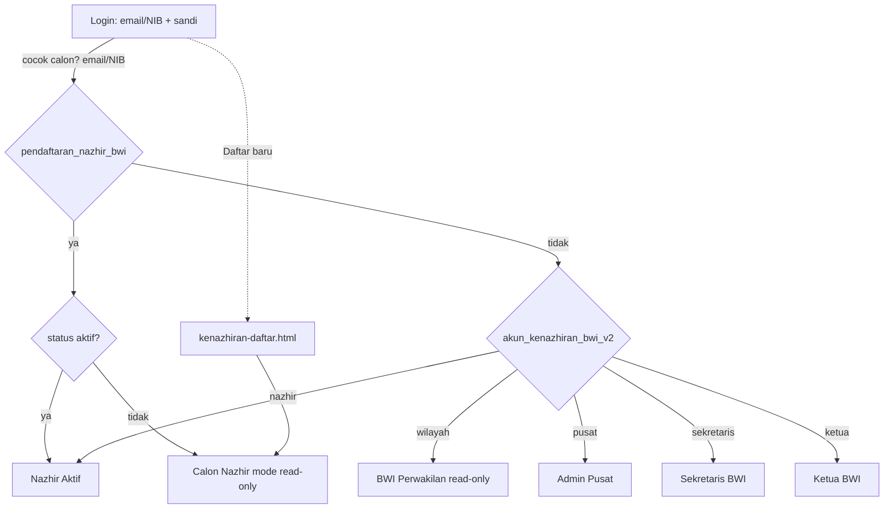
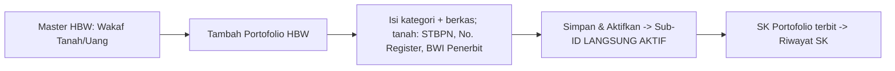
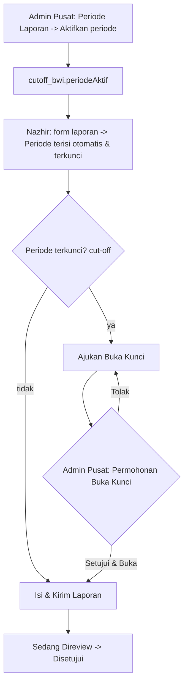
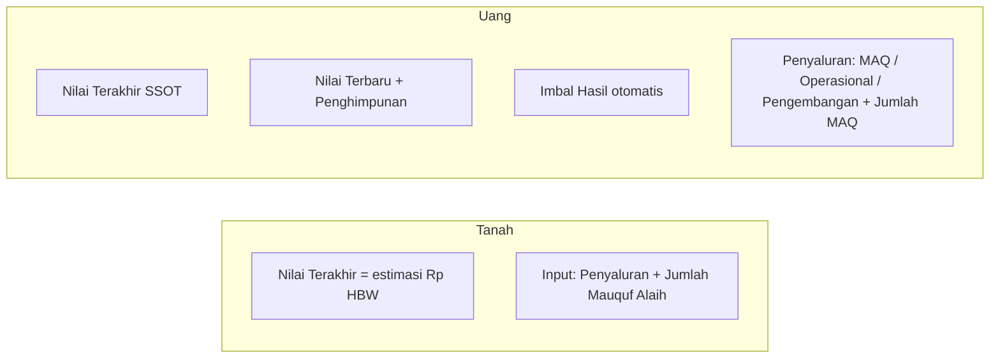

# PRD & Flow Design — Modul Kenazhiran (BWI SuperApps / Titik Terang OS)

> Dokumen ini merangkum **Product Requirement** dan **Flow Design** untuk seluruh menu pada prototipe **Modul Kenazhiran BWI**. Prototipe berupa **mockup HTML + Tailwind (vanilla JS + sebagian React via Babel)** dengan **localStorage** sebagai simulasi basis data (single-tenant, tanpa backend).

- **Produk:** Modul Kenazhiran — pengelolaan Nazhir, Harta Benda Wakaf (HBW), pelaporan, dan tata kelola nasional.
- **Identitas visual:** Deep Teal (`brand` 50→900), font Outfit, ikon inline SVG (tanpa emoji), shell TailAdmin (sidebar + topbar).
- **Bahasa UI:** Indonesia.

---

## 1. Ringkasan Produk (Vision)

Menyediakan satu sistem terintegrasi bagi ekosistem perwakafan Indonesia yang menghubungkan **Nazhir**, **BWI Perwakilan**, dan **BWI Pusat** dalam satu identitas **NIB (Nomor Induk BWI) tunggal**. Sistem memfasilitasi:

1. **Pendaftaran & sertifikasi Nazhir** (progresif, berbasis kelengkapan berkas + presentasi).
2. **Pencatatan Harta Benda Wakaf (HBW)** — wakaf tanah & wakaf uang — sebagai Sub‑ID di bawah NIB.
3. **Pelaporan berkala** dengan konsep **SSOT (Single Source of Truth)** dan **cut‑off periode**.
4. **Tata kelola nasional** oleh BWI Pusat: verifikasi, penerbitan SK, periode laporan, penguncian, dan pembukaan akses.

---

## 2. Peran (Roles) & Akun Demo

| Peran | Deskripsi | Email | Sandi | Landing |
|---|---|---|---|---|
| **Nazhir Aktif** | Lembaga wakaf tersertifikasi (punya NIB). Akses penuh (CUD) atas HBW, program, & pelaporan. | `yayasannusantara@bwi.go.id` | `password` | `nazhir-dashboard.html` |
| **Calon Nazhir** | Lembaga dalam proses pendaftaran. Shell penuh tapi **read‑only** & data kosong sampai disetujui. | *daftar sendiri* | *dibuat sendiri* | `nazhir-dashboard.html` (mode calon) |
| **BWI Perwakilan** (Verifikator Wilayah) | Pemegang akun perwakilan. Memantau data kenazhiran daerah — **read‑only**. | `perwakilan@bwi.go.id` | `password` | `wilayah-dashboard.html` |
| **Administrator Pusat** | Admin BWI Kenazhiran Pusat. Tata kelola nasional penuh. | `adminpusat@bwi.go.id` | `password` | `pusat-dashboard.html` |
| **Sekretaris BWI** | Meninjau **setiap** pendaftaran nazhir; **meneruskan** yang telah disetujui Pusat ke Ketua untuk ditandatangani. | `sekretaris@bwi.go.id` | `password` | `sekretaris-pendaftaran.html` |
| **Ketua BWI** | **Menandatangani** (TTD digital + passphrase) pendaftaran yang telah diteruskan Sekretaris → menerbitkan NIB & SK. | `ketua@bwi.go.id` | `password` | `ketua-pendaftaran.html` |

- Autentikasi berbasis **email/NIB + sandi** yang tersimpan di `localStorage` (`akun_kenazhiran_bwi_v2`). Calon Nazhir tersimpan di `pendaftaran_nazhir_bwi`. Login memakai **satu kolom identitas** (bukan pemilih peran) — peran dikenali otomatis dari akun yang cocok. **Nazhir aktif** boleh masuk memakai **email atau NIB** (akun demo nazhir: NIB `NZHR-BDG-170`). Calon Nazhir yang mendaftar langsung dapat login dengan email + sandi‑nya.
- Sesi aktif: `sesi_kenazhiran = { mode, peran, nama }`.

---

## 3. Arsitektur Informasi (Peta Menu)

### 3.1 Auth
- **Login** (`kenazhiran-login.html`) — email/sandi + panel akun demo.
- **Pendaftaran Calon Nazhir** (`kenazhiran-daftar.html`) — form registrasi 2 fase.

### 3.2 Role: Nazhir (Aktif & Calon)
| Menu | Sub‑menu | Halaman |
|---|---|---|
| **Dashboard NIB** | — | `nazhir-dashboard.html` |
| **Master HBW** | Wakaf Tanah | `nazhir-aset.html?jenis=tanah` |
| | Wakaf Uang | `nazhir-aset.html?jenis=uang` |
| **Laporan HBW** | Pelaporan Wakaf Tanah | `nazhir-laporan-program.html?jenis=tanah` |
| | Pelaporan Wakaf Uang | `nazhir-laporan-program.html?jenis=uang` |
| | Pelaporan Mutasi Aset | `nazhir-laporan.html` |
| **Riwayat & Dokumen** | — | `nazhir-dokumen.html` |
| **Permohonan Buka Kunci** | — | `nazhir-buka-kunci.html` |

Halaman pendukung (tanpa menu langsung): `nazhir-aset-tambah.html` (tambah HBW), `nazhir-aset-detail.html`, `nazhir-aset-sk.html` (Riwayat SK Portofolio), `nazhir-sk.html` (SK Pendaftaran), `nazhir-pendaftaran.html` (checklist berkas calon), `nazhir-laporan-isi.html`, `nazhir-laporan-detail.html`, `nazhir-laporan-baru.html`.

> Catatan: menu **Master Program** disembunyikan (halaman `nazhir-program.html` masih ada namun tidak ditautkan).

### 3.3 Role: BWI Pusat (Administrator)
| Menu | Halaman |
|---|---|
| **Dashboard Nasional** | `pusat-dashboard.html` |
| **Master NIB Tunggal** | `pusat-master.html` |
| **Periode Laporan** | `pusat-periode.html` |
| **Kelola Broadcast** | `pusat-broadcast.html` |
| **Pendaftaran Nazhir** | `pusat-pendaftaran.html` → detail `pusat-pendaftaran-detail.html` |

Pendukung: `pusat-hierarki.html`. Halaman berikut **masih ada namun tidak lagi ditautkan** dari menu: `pusat-cutoff.html` (menu "Kelola Cut‑Off Periode" dihapus — beririsan dengan Periode Laporan) dan `pusat-portofolio.html`/`pusat-portofolio-review.html` (menu **"Pengajuan Portofolio" disembunyikan** karena penambahan HBW oleh Nazhir kini langsung aktif tanpa persetujuan Pusat — lihat §5.9).

### 3.4 Role: BWI Perwakilan (Wilayah — read‑only)
| Menu | Halaman |
|---|---|
| **Dashboard & Inbox** | `wilayah-dashboard.html` |
| **Master Data Nazhir Daerah** (Buku Induk) | `wilayah-master.html` |
| **Rekapitulasi Wilayah** | `wilayah-rekap.html` |
| Tinjauan Dokumen Pelaporan | `wilayah-review.html` |

### 3.5 Role: Sekretaris BWI
| Menu | Halaman |
|---|---|
| **Pendaftaran Nazhir** (pantau semua + teruskan ke Ketua) | `sekretaris-pendaftaran.html` |

### 3.6 Role: Ketua BWI
| Menu | Halaman |
|---|---|
| **Pengesahan Nazhir** (TTD digital + passphrase) | `ketua-pendaftaran.html` |

---

## 4. Model Data (localStorage)

| Kunci | Isi |
|---|---|
| `akun_kenazhiran_bwi_v2` | Array akun bawaan (nazhir, wilayah, pusat, **sekretaris, ketua**). Akun nazhir memiliki field **`nib`** (mis. `NZHR-BDG-170`) agar bisa login via NIB. Saat login, akun seed baru yang belum ada **digabung otomatis** ke storage lama (tanpa menimpa akun eksisting). |
| `pendaftaran_nazhir_bwi` | Data + akun Calon Nazhir (berkas, status pendaftaran, jadwal, NIB, SK). Field rantai tanda tangan: `disetujuiPusat`, `diteruskanOleh`, `tglTeruskan`, `ttdOleh`, `tglTtd`, `ttdId`. |
| `pendaftaran_dummy_bwi_v2` | Data dummy pipeline pendaftaran (dibagikan lintas peran Pusat/Sekretaris/Ketua). Status kini termasuk `sekretariat` & `ttd`. |
| `sesi_kenazhiran` | Sesi aktif `{ mode, peran, nama }`. |
| `graduasi_baru_bwi` | Flag satu‑kali banner "akun aktif" pasca‑persetujuan. |
| `status_nazhir_bwi` | Status lembaga `{ lembaga: 'aktif' \| 'dibekukan' }`. |
| `data_portofolio_bwi` | Daftar HBW (Sub‑ID) — wakaf tanah & uang, beserta status & detail. |
| `data_program_bwi` | Master Program (baseline SSOT program). |
| `data_mutasi_bwi` | Laporan mutasi aset (tanah). |
| `data_laporan_program_bwi` | Laporan progres HBW (tanah & uang). |
| `detail_laporan_bwi` | Detail entri laporan. |
| `cutoff_bwi` | Periode & penguncian `{ periodeAktif, items: { <periode>: { deadline, terkunci, semester, tahun } } }`. |
| `buka_kunci_bwi` | Permohonan buka kunci dari Nazhir. |
| `notifikasi_bwi` | Notifikasi / peringatan deadline & broadcast alert ke Nazhir (dibaca lonceng Nazhir; entri `{ id, lembaga, judul, pesan, periode, tanggal, tipe }`, `lembaga: '*'` = semua). |
| `broadcast_alert_bwi` | Template pesan broadcast Admin Pusat. Array `{ id, judul, pesan, target: 'semua' \| [<label periode>…], aktif, terkirim?, tanggal? }`. Aktivasi otomatis mengirim broadcast. |
| `active_*` / `toast_pending_bwi` / `dokumen_preview_*` | Context passing antar halaman & toast tertunda. |

---

## 5. Spesifikasi Menu (PRD per fitur)

### 5.1 Login & Pendaftaran
- **Login:** kolom **Email atau NIB** + sandi (localStorage) — **tanpa pemilih/selektor peran** & tanpa panel "Akun demo". Peran dikenali otomatis; nazhir aktif bisa via email atau NIB. Diarahkan sesuai peran.
- **Pendaftaran Calon Nazhir (2 fase):**
  - **Fase 1** (`kenazhiran-daftar.html`): nama badan hukum, email, PIC, HP, sandi + persetujuan → status `draft` → langsung masuk sebagai Calon.
  - **Fase 2** (`nazhir-pendaftaran.html`): checklist **16 berkas** dalam 4 kelompok (Administrasi & Legalitas, Pengurus & Kompetensi, Rencana & Keuangan, Surat Pernyataan) — layout **navigasi 30% / konten 70%**. Aksi: unggah/hapus, Simpan & Lanjutkan Nanti, **Ajukan Verifikasi**.

### 5.2 Nazhir — Dashboard NIB
Ringkasan NIB lembaga, jumlah Sub‑ID/portofolio aktif, status verifikasi, dan (untuk hasil graduasi) **kartu akses SK** + banner "Selamat, akun aktif" (satu kali). Mode **Calon** menampilkan banner status kontekstual + CTA dinamis (Lanjutkan Pendaftaran / Perbaiki Berkas / Daftar Ulang / Lihat Detail).

### 5.3 Nazhir — Master HBW (Wakaf Tanah / Wakaf Uang)
- Daftar Sub‑ID aset di bawah satu NIB, **difilter per jenis** (dari submenu) + **search bar** + filter status.
- **Tambah Portofolio HBW** (`nazhir-aset-tambah.html?jenis=`): 
  - **Kategori** berupa **dropdown** sesuai jenis:
    - *Tanah:* Wakaf Tanah, Wakaf Temporer Jangka Pendek, Wakaf Temporer Jangka Panjang (satuan **M²**, punya **detail legalitas + koordinat peta**).
    - *Uang:* Wakaf Uang, Wakaf Melalui Uang, Wakaf Bergerak Selain Uang, Wakaf Uang Temporer Jangka Pendek/Panjang (satuan **Rp**).
  - *Uang* juga: **Jenis Program** (Wakaf Produktif / Sosial & Ibadah / Pendidikan / Kesehatan / Infrastruktur) & **Instrumen Investasi** (combobox searchable + "tambah data baru").
  - *Tanah* juga: dokumen wajib **STBPN** (Surat Tanda Bukti Pendaftaran Nazhir dari BWI setempat sesuai luasan tanah) di Dokumen Persyaratan, plus field **Nomor Register** (input teks) & **BWI Penerbit** (combobox searchable + "tambah data baru") di detail legalitas.
  - Alur status Sub‑ID: **Draft → Aktif** — **tanpa persetujuan BWI Pusat** (HBW yang diajukan langsung aktif; tombol "Simpan & Aktifkan").
- **Riwayat SK Portofolio** (`nazhir-aset-sk.html`): SK per Sub‑ID aktif (Nomor SK, preview, cetak).

### 5.4 Nazhir — Laporan HBW
- **Pelaporan Wakaf Uang** (`?jenis=uang`): pilih **HBW yang Dilaporkan** (bukan program) → **Periode** terisi otomatis & terkunci → **Nilai Terakhir** (SSOT) → input **Nilai Terbaru**, **Penghimpunan Baru**; **Imbal Hasil** otomatis; **Penyaluran** (MAQ, Operasional, Pengembangan) ≤ imbal hasil + persentase; **Jumlah MAQ** (penerima). Draft dapat diedit.
- **Pelaporan Wakaf Tanah** (`?jenis=tanah`): pilih **HBW yang Ingin Dilaporkan** → Periode otomatis+terkunci → Nilai Terakhir (dari **nilai estimasi Rp** HBW) → input **Penyaluran (Rp)** + **Jumlah Mauquf Alaih**. Tanpa penerimaan/imbal hasil/perubahan nilai. Tabel riwayat: kolom Harta Benda Wakaf · Periode · Penyaluran · Jumlah MAQ · Status.
- **Pelaporan Mutasi Aset** (`nazhir-laporan.html`): pelaporan mutasi/aset tanah, dengan enforcement cut‑off.

### 5.5 Nazhir — Riwayat & Dokumen / Permohonan Buka Kunci
- **Riwayat & Dokumen:** arsip dokumen legalitas & riwayat.
- **Permohonan Buka Kunci:** kartu info **periode aktif + rentang bulan + deadline**, lalu riwayat permohonan; ajukan pembukaan akses bila periode terkunci (cut‑off).

### 5.6 Pusat — Dashboard, Master NIB, Hierarki
- **Dashboard Nasional:** metrik agregat nasional.
- **Master NIB Tunggal:** buku induk NIB; termasuk **bekukan/aktifkan** lembaga. Tombol **"Lihat Hierarki"** membuka `pusat-hierarki.html`.
- **Hierarki (`pusat-hierarki.html`):** peta relasi NIB → Sub‑ID → program. Tabel **"Daftar Sub‑ID Portofolio Aktif"** dipisah **tab** — **hanya Wakaf Uang & Wakaf Tanah** (tanpa tab "Semua"; portofolio selalu terpisah per jenis), badge jumlah per tab, default **Wakaf Uang**. Kolom nilai **tidak mencampur satuan**: header **"Saldo Terkini"** (Rp) di tab Wakaf Uang, **"Luas Terkini"** (M²) di tab Wakaf Tanah. Read‑only; dibedakan via field `kategori` (`'uang'`/`'tanah'`).

### 5.7 Pusat — Kelola Broadcast
Mengelola **template pesan broadcast** ke Nazhir yang mengingatkan *"sudah saatnya menyiapkan laporan"* (`pusat-broadcast.html`, menu **"Kelola Broadcast"**).
- **Tambah/Edit template** (modal lebar, layout 2‑kolom agar ringkas): **Judul/Nama Template**, **Isi Pesan** (textarea), **Target Periode** berupa **dropdown checklist + searchbar** (bisa dicari sekaligus multi‑pilih: *Semua Periode* atau **satu/beberapa** periode) — daftar periode **sinkron otomatis** dari menu Periode Laporan (`cutoff_bwi.items`), dan **toggle Aktif/Nonaktif**.
- **Status & pengiriman otomatis:** kolom **Aksi** hanya berisi tombol **dinamis Aktifkan/Nonaktifkan** (tidak ada tombol "Kirim"). Saat template **menjadi Aktif** (dibuat aktif atau di‑toggle Aktif), broadcast **otomatis terkirim** ke Nazhir. Nonaktifkan untuk menghentikan.
- **CRUD** pada tabel (**Judul Template** saja — tanpa cuplikan isi; Target Periode, Status Aktif, Terkirim, Aksi): **toggle aktif** (dinamis), **lihat** (pratinjau isi lengkap), **edit**, **hapus**. Kolom **Target Periode** menampilkan *Semua Periode*, label tunggal, atau `"<periode pertama> +N lainnya"` bila multi (daftar lengkap muncul saat hover). Kartu ringkasan: Total / Aktif / Terkirim.
- **Integrasi notifikasi Nazhir:** aktivasi mendorong entri ke `notifikasi_bwi` (`{ id, lembaga: '*', judul, pesan, periode, tanggal, tipe: 'broadcast' }`) → tampil di lonceng Nazhir (`periode` = daftar label target, atau kosong bila "Semua Periode"). Cara Nazhir membaca notifikasi tidak diubah.
- **Penyimpanan:** kunci `broadcast_alert_bwi` (target `'semua'` **atau array label periode**).

> **Catatan — Kelola Cut‑Off Periode (`pusat-cutoff.html`):** penguncian **nasional** per periode + deadline + kirim peringatan. Menu ini **tidak lagi ditautkan** di sidebar (dinilai tidak relevan / beririsan dengan Periode Laporan); halaman tetap ada namun tak tertaut.

### 5.8 Pusat — Periode Laporan
- **Tambah/Edit Periode (fleksibel):** toggle **Aktif/Nonaktif**, **2 dropdown bulan** (bulan mulai → bulan akhir) sehingga rentang bebas — **bulanan, triwulan, semester, tahunan**, dst. — + **counter Tahun** (+/−). **Tanpa deadline** (datepicker dihapus). Label periode = rentang bulan + tahun (mis. *"Januari – Juni 2027"*, *"Januari – Maret 2027"*, *"April 2027"*). Validasi: bulan akhir ≥ bulan mulai. CRUD (lihat, edit, hapus, aktifkan).
- **Status Kunci** pada daftar selalu **Terbuka** (penguncian dikelola di Cut‑Off).
- Kolom **Jumlah Laporan** (menghitung laporan yang memakai periode tsb).
- **Filter status** pada tabel Daftar Periode Laporan: **Semua / Aktif / Nonaktif**.
- **Integrasi:** periode yang **diaktifkan** → `cutoff_bwi.periodeAktif` → mengisi otomatis kolom Periode pada form laporan Nazhir.
- **Permohonan Buka Kunci** (tabel, dipindah dari Cut‑Off): setujui/tolak per‑Nazhir, dengan **filter status** (Semua / Menunggu / Disetujui / Ditolak).

### 5.9 Pusat — Pengajuan Portofolio *(menu disembunyikan)*
> **Catatan (revisi):** penambahan HBW oleh Nazhir kini **langsung aktif tanpa persetujuan Pusat**, sehingga halaman ini **tidak lagi menerima pengajuan baru** (menjadi legacy/arsip) dan **menu "Pengajuan Portofolio" disembunyikan** dari sidebar seluruh halaman Pusat (blok `<li>` di‑*comment‑out*, mudah diaktifkan kembali). Halaman `pusat-portofolio.html`/`pusat-portofolio-review.html` tetap ada namun tak tertaut. Alur lama: verifikasi Sub‑ID baru dengan stepper Diajukan → Verifikasi Sekretariat → E‑Sign Pimpinan → SK Terbit, aksi Setujui & Aktifkan.

### 5.10 Pusat — Pendaftaran Nazhir
Pipeline verifikasi pendaftaran (tab **Histori / Verifikasi Dokumen / Jadwal / Hasil / Persetujuan**) + **filter status** + search. **Detail** dibuka di halaman (`pusat-pendaftaran-detail.html`), bukan modal — dengan aksi per tahap; setelah aksi → **toast + kembali ke tab semula**. Layout detail: Info Pemohon + Keputusan di atas, **Kelengkapan Berkas full‑width** di bawah.
- **Wewenang Admin Pusat dibatasi s.d. input hasil wawancara.** Admin beraksi pada tahap **Verifikasi Dokumen → Jadwal → Input Hasil** saja. Saat hasil **Lulus** → status `persetujuan`. **Admin tidak lagi bisa menyetujui/menerbitkan SK** — tombol "Setujui" dihapus. Persetujuan menjadi wewenang **Sekretaris & Ketua BWI**.
- **Tab "Persetujuan & Pengesahan" (pantau progres).** Tab ini menampilkan status `persetujuan` → `ttd` → `aktif` sebagai **read‑only** agar Admin tahu progres sampai mana. Saat sudah `aktif`, Admin dapat **Preview SK** (sertifikat ber‑QR terverifikasi).

### 5.11 Wilayah — read‑only
Dashboard & inbox, buku induk nazhir daerah, rekapitulasi, dan tinjauan dokumen pelaporan — **tanpa aksi (read‑only)**.

### 5.12 Sekretaris BWI — Pendaftaran Nazhir (`sekretaris-pendaftaran.html`)
- **Memantau setiap pendaftaran** nazhir dengan **informasi lengkap** (kartu ringkasan: Perlu Diteruskan / Sudah Diteruskan / Sudah Disahkan / Total) + search + **filter status**.
- **Teruskan ke Ketua BWI:** untuk pendaftaran yang **lulus wawancara** (status `persetujuan`), tombol **"Teruskan ke Ketua BWI"** (dengan konfirmasi) → status `ttd`, mencatat `diteruskanOleh` + `tglTeruskan`.
- **Detail (read‑only):** info pemohon, riwayat (presentasi/wawancara → hasil → diteruskan → ditandatangani), dan kelengkapan berkas.
- **Lihat Sertifikat:** setelah `aktif`, Sekretaris dapat membuka **sertifikat/SK ber‑QR terverifikasi** (progres pengesahan ikut terlihat di sisinya).

### 5.13 Ketua BWI — Pengesahan Nazhir (`ketua-pendaftaran.html`)
- **Antrean pengesahan:** kartu **Menunggu Tanda Tangan** (`ttd`) & **Sudah Ditandatangani** (`aktif`), search + filter. Melihat pendaftaran yang **telah diteruskan Sekretaris** beserta informasi lengkap.
- **Tanda Tangan Digital / e‑Sign (passphrase):** untuk status `ttd`, tombol **"Tandatangani"** membuka modal passphrase (demo: `bwi2026`). Passphrase benar → status `aktif`, terbit **NIB** + **SK/Sertifikat** dengan **QR Code terverifikasi** + metadata tanda tangan elektronik (`ttdOleh`, `tglTtd`, `ttdId`). **Preview SK** menampilkan QR terverifikasi + tanda tangan Ketua — dan versi **Draf** (QR "terbit setelah TTD") saat masih `ttd`.
- SK dapat **dicetak/PDF**.
- **Sertifikat muncul di semua sisi:** setelah ditandatangani, SK ber‑QR yang sama tampil di **Admin Pusat** (Preview SK), **Sekretaris** (Lihat Sertifikat), dan **Calon/Nazhir** (`nazhir-sk.html`).

---

## 6. Siklus Status (State Lifecycles)

### 6.1 Pendaftaran Nazhir
`draft → diajukan → (revisi | ditolak | diverifikasi) → terjadwal → persetujuan → ttd → aktif`
- **terjadwal → persetujuan:** Admin Pusat **input hasil wawancara LULUS** (batas akhir wewenang Admin; Admin tak bisa menyetujui/menerbitkan SK).
- **persetujuan → ttd:** **Sekretaris BWI** meneruskan ke Ketua (`diteruskanOleh`, `tglTeruskan`).
- **ttd → aktif:** **Ketua BWI** e‑Sign (passphrase) → terbit **NIB + SK/Sertifikat ber‑QR terverifikasi** (`ttdOleh`, `tglTtd`, `ttdId`) yang tampil di sisi Admin, Sekretaris, & Calon/Nazhir.
- *(Status `sekretariat` dari revisi sebelumnya tak lagi dihasilkan; badge lama tetap dikenali demi kompatibilitas data.)*
- **revisi** → calon perbaiki → ajukan ulang.
- **ditolak** → daftar ulang dari awal.
- **aktif** → graduasi: mode sesi menjadi `aktif`, NIB & SK terbit.

### 6.2 Portofolio HBW (Sub‑ID)
`draft → aktif` — **tanpa persetujuan Pusat** (langsung aktif saat disimpan/diajukan) → (opsional) `nonaktif`. SK per Sub‑ID terbit saat `aktif`.

### 6.3 Laporan
`Draft → Sedang Direview → Disetujui`. Draft dapat diedit; laporan terfilter per‑jenis (tanah/uang).

### 6.4 Periode / Cut‑off
Periode kini **fleksibel** (rentang bulan bebas: bulanan/triwulan/semester/tahunan) + tahun, **tanpa deadline**. Periode dapat **Aktif/Nonaktif** (hanya satu aktif) dan otomatis mengisi kolom Periode pada laporan Nazhir. Penguncian **Terkunci/Terbuka** dikelola terpisah (nasional). Jika periode terkunci, Nazhir mengajukan **Buka Kunci** (per‑Nazhir): `menunggu → disetujui | ditolak`. Model data: `cutoff_bwi.items[label] = { bulanMulai, bulanAkhir, tahun, terkunci }`.

---

## 7. Flow Design (Diagram)

### 7.1 Otentikasi & Routing Peran

### 7.2 Pendaftaran Nazhir → SK/NIB

```mermaid
flowchart LR
  R1[Calon daftar Fase 1] --> R2[Lengkapi 16 berkas Fase 2]
  R2 --> R3[Ajukan Verifikasi]
  R3 --> V{Admin Pusat}
  V -- Revisi --> R2
  V -- Tolak --> RX[Ditolak -> Daftar Ulang]
  V -- Verifikasi Dokumen --> J[Jadwalkan Presentasi]
  J --> H[Input Hasil Presentasi]
  H -- "Admin: Lulus (batas wewenang Admin)" --> S[Persetujuan: menunggu Sekretaris]
  H -- Tidak Lulus --> RX
  S -- "Sekretaris: Teruskan ke Ketua BWI" --> TTD[Menunggu TTD Ketua]
  TTD -- "Ketua: e-Sign + passphrase" --> A[Aktif: NIB + SK/Sertifikat ber-QR terverifikasi]
  A --> G[Muncul di Admin, Sekretaris & Calon/Nazhir + banner graduasi]
```

### 7.3 Tambah HBW → SK Portofolio (tanpa persetujuan Pusat)

### 7.4 Pelaporan HBW & Cut‑off

### 7.5 Konteks Jenis HBW (Tanah vs Uang)

---

## 8. Aturan Bisnis Utama (Business Rules)

1. **NIB tunggal:** semua HBW adalah Sub‑ID di bawah satu NIB lembaga.
2. **SSOT & anti‑duplikasi:** "nilai terakhir" laporan ditarik dari laporan non‑draft terakhir (bukan memutasi store), agar delta antar‑periode tidak terhitung ganda.
3. **Wakaf tanah tidak mengubah nilai** dari laporan — hanya penyaluran + jumlah penerima.
4. **Penyaluran wakaf uang ≤ imbal hasil** (jumlah MAQ + Operasional + Pengembangan).
5. **Periode aktif tunggal** — hanya satu periode yang aktif; mengisi kolom Periode Nazhir otomatis & terkunci.
6. **Penguncian nasional, pembukaan per‑Nazhir** — cut‑off dikunci sekali oleh Pusat, dibuka per‑Nazhir via persetujuan permohonan.
7. **Read‑only untuk Calon & Wilayah** — tanpa aksi CUD di luar konteksnya.
8. **Dua jenis SK:** SK Pendaftaran Nazhir (sekali, saat jadi Nazhir) dan SK Portofolio (per Sub‑ID HBW yang disetujui).

---

## 9. Batasan Prototipe (Non‑Goals / Limitations)

- **Tanpa backend** — semua data di `localStorage` (single‑tenant, per‑peramban). Kata sandi tidak dienkripsi.
- **Single‑tenant:** Nazhir hasil graduasi berbagi shell dengan Nazhir demo (data demo).
- **Simulasi:** SK/QR/TTD digital bersifat placeholder; notifikasi & email hanya simulasi UI.
- Menu **Master Program** & **Kelola Cut‑Off** beririsan dengan **Periode Laporan** (kandidat konsolidasi).

---

*Dokumen ini mencerminkan kondisi prototipe saat penulisan dan dapat diperbarui seiring iterasi fitur.*
